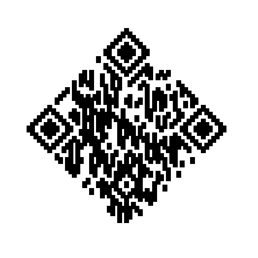
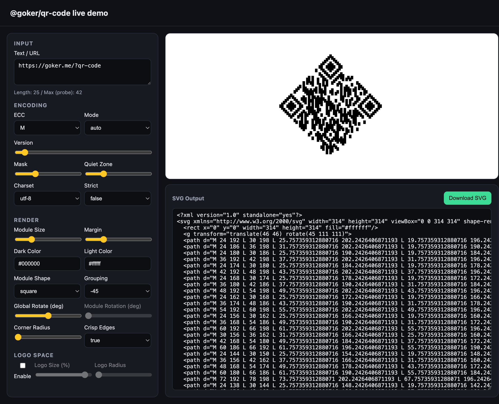

# @goker/qr-code

[](https://www.npmjs.com/package/@goker/qr-code)

[](LICENSE)
[](https://www.buymeacoffee.com/goker)
[](https://github.com/sponsors/gokerDEV)

**Minimal SVG Output Library (Powered by `qr-core`)**

<table>
  <tr>
    <td valign="top">
      <p><code>@goker/qr-code</code> is a lightweight, zero-dependency (other than <code>qr-core</code>) library for generating QR codes directly as SVG strings. It is designed to be:</p>
      <ul>
        <li><b>Deterministic</b>: Same input + options = byte-identical output.</li>
        <li><b>Universal</b>: Works in Node.js, Browsers, Edge Runtimes, and Cloudflare Workers (no DOM/Canvas required).</li>
        <li><b>Strict</b>: Written in TypeScript 5.x with <code>strict: true</code>.</li>
        <li><b>Optimized</b>: Merges adjacent modules into single path elements to minimize SVG size (in standard modes).</li>
      </ul>
    </td>
    <td valign="top">
      <div align="center">
        
        <br />
        <br />
        <p>It supports <a href="./DIAMOND.md">diamond shape rendering</a>.</p>
      </div>
    </td>
  </tr>
</table>

## Installation

```bash
npm install @goker/qr-code
```

JSR:

```bash
npx jsr add @goker/qr-code
```

## Usage

### 1. Simple Encode & Render (Recommended)

Use `toSvgString` to encode text and get an SVG string in one step:

```typescript
import { toSvgString } from "@goker/qr-code";

const svg = toSvgString("https://example.com", {
  // Encoding Options (passed to qr-core)
  ecc: "M",           // 'L', 'M', 'Q', 'H'
  version: "auto",    // 1-40 or 'auto'
  mask: "auto",       // 0-7 or 'auto'

  // Rendering Options
  render: {
    moduleSize: 10,   // px per module
    margin: 4,        // Modules of white space around
    darkColor: "#000000",
    lightColor: "#ffffff",
    viewBox: true,    // Include viewBox attribute
    cornerRadius: 2   // Round corners
  }
});

console.log(svg);
// Output: <svg ...>...</svg>
```

### 2. Advanced: Render Pre-Encoded Matrix

If you already have a `qr-core` object (or any compatible `QrLike` structure), you can use `renderSvg` directly. This is useful if you want to reuse the same calculated matrix for multiple outputs/formats.

```typescript
import { encode } from "qr-core";
import { renderSvg } from "@goker/qr-code";

// 1. Encode separately
const qr = encode("https://example.com", { ecc: "H" });

// 2. Render
const svg = renderSvg(qr, {
  moduleSize: 4,
  darkColor: "#333",
  lightColor: "transparent", // Transparent background
  grouping: "dot",           // "dot", "row", "col", "blob", "45", "-45"
  moduleShape: "circle"      // "circle" or "square"
});
```

## API Reference

### `toSvgString(input, options?)`

Encodes input text and returns a complete SVG string.

-   **`input`**: string - The text to encode.
-   **`options`**: `ToSvgStringOptions`
    -   All `qr-core` encoding options (`ecc`, `version`, `mask`, `mode`, `strict`, ...).
    -   `render`: `RenderSvgOptions` (see below).

### `renderSvg(qr, options?)`

Renders an existing QR matrix to an SVG string.

-   **`qr`**: `QrLike` object (`{ size: number, matrix: { get(x,y): 0|1 } }`).
-   **`options`**: `RenderSvgOptions`

### `RenderSvgOptions`

| Option | Type | Default | Description |
| :--- | :--- | :--- | :--- |
| `moduleSize` | `number` | `4` | Pixel size of each module (must be integer > 0). |
| `margin` | `number` | `4` | Quiet zone size in modules (0-64). |
| `darkColor` | `string` | `"#000"` | CSS color for dark modules. |
| `lightColor` | `string` | `"transparent"` | CSS color for background. |
| `xmlDeclaration` | `boolean` | `false` | Prepend `<?xml ...?>` tag. |
| `viewBox` | `boolean` | `true` | Include `viewBox` attribute on `<svg>`. |
| `crispEdges` | `boolean` | `true` | Add `shape-rendering="crispEdges"`. |
| `grouping` | `string` | `"row"` | Grouping strategy: `"row"`, `"col"`, `"dot"`, `"blob"`, `"45"`, `"-45"`. |
| `moduleShape` | `"square" \| "circle"` | `"square"` | Shape of individual modules. |
| `rotateDeg` | `number` | `0` | Global rotation of the QR code in degrees. |
| `moduleRotationDeg` | `number` | `0` | Rotation of individual square modules in degrees. |
| `cornerRadius` | `number` | `0` | Radius for rounding corners of modules/paths. |

## Contributing

Thanks for contributing! This project aims to stay lightweight, pure TypeScript, and easy to consume in both Node and browser runtimes.

### Requirements

- Node.js >= 18
- npm

### Setup

```bash
npm install
```

### Development Commands

```bash
npm run build
npm test
npm run lint
```

### Project Notes

- Source lives in `src/` and must remain framework-agnostic and runtime-neutral.
- Public API is exported from `src/index.ts`.
- Keep output deterministic; avoid adding non-deterministic rendering or environment-specific behavior.
- Keep TypeScript `strict` compatibility.

### Pull Requests

- Prefer small, focused changes.
- Update docs and tests if behavior changes.
- Ensure `npm test` and `npm run lint` pass.

### Status & Roadmap

The current implementation has some known deviations from the internal `DIAMOND.md` specification:

1.  **Polygon vs Path**: The library currently uses `<path>` elements for all rendering (including diagonal diamond shapes) instead of `<polygon>` elements. This is done to support corner rounding (filleting) via path commands (`Q`) directly.
2.  **Trapezoid Shapes**: The strictly defined "trapezoid" shapes for diagonal grouping are not implemented. The current renderer relies on rotated rectangles (parallelograms) and path unions.
3.  **Optimization**: Horizontal merging is primarily effective in `grouping: "row"` (default). Other grouping modes may produce more complex paths.


### Testing

QR output is cross-checked against Nayuki's QR Code generator (typescript-javascript) to validate matrix correctness.

### Demo

Live demo is available under `demo/index.html`.



Instructions:

```bash
npm install
npm run build
npx serve .
```

Then open `http://localhost:3000/demo/` in your browser.

## License

MIT
